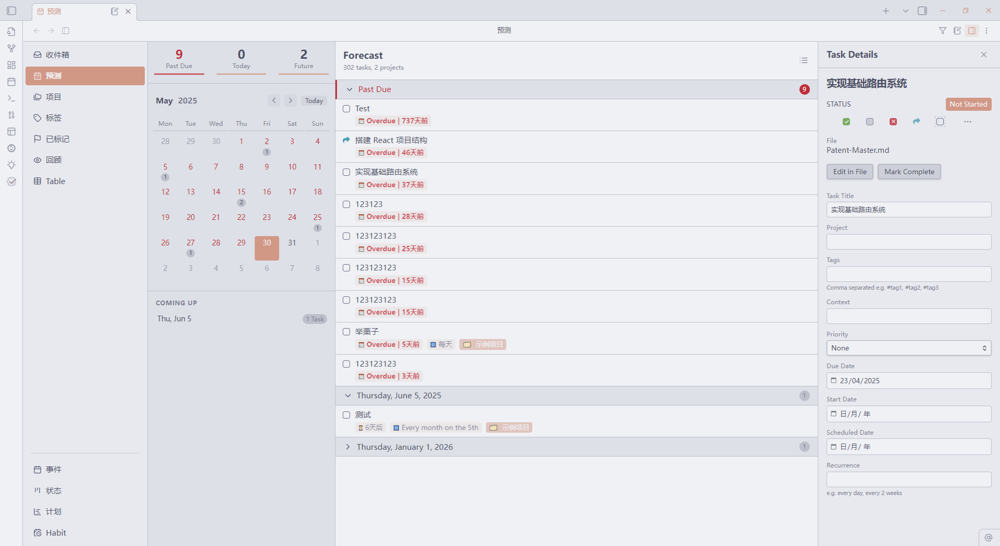
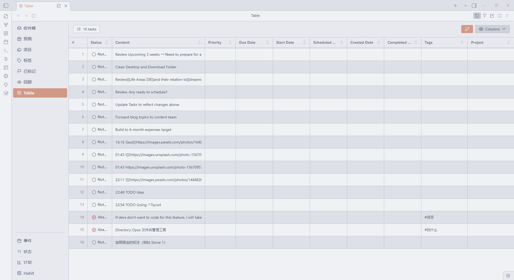

  

  **The Ultimate Task Management Plugin for Obsidian**

  
  

  Transform your Obsidian vault into a powerful task management system with advanced features, beautiful visualizations, and seamless workflow integration.

  [📖 Documentation](https://taskgenius.md/docs/getting-started) • [🚀 Installation](https://taskgenius.md/docs/installation) • [💬 Community](https://discord.gg/ARR2rHHX6b)

---

## 🌟 Overview

Task Genius is a comprehensive task management plugin that transforms Obsidian into a powerful productivity hub. Whether you're managing personal projects, tracking habits, or coordinating complex workflows, Task Genius provides the tools you need while preserving Obsidian's philosophy of plain-text, future-proof note-taking.

### 📸 Screenshots

| Forecast View | Inbox Management |
|:-------------:|:----------------:|
|  |  |

---

## ✨ Core Features

### 🎯 **Task Management & Visualization**

#### **Smart Progress Tracking**
- **Visual Progress Bars**: Automatic progress visualization for parent tasks based on sub-task completion
- **Multiple Display Modes**: Choose between graphical bars, text-based indicators, or custom formats
- **Heading Integration**: Progress bars work seamlessly with Markdown headings and list items
- **Real-time Updates**: Progress updates automatically as you complete sub-tasks

#### **Advanced Task Statuses**
- **Extended Status System**: Beyond basic todo/done - includes In Progress `[/]`, Planned `[?]`, Abandoned `[-]`, and more
- **Status Cycling**: Click through task statuses or use keyboard shortcuts for rapid updates
- **Custom Status Definitions**: Define your own task states with custom icons and behaviors
- **Bulk Status Operations**: Update multiple tasks simultaneously

### 📅 **Date & Priority Management**

#### **Intelligent Date Handling**
- **Calendar Picker Integration**: Visual date selection with `📅 2023-12-25` format
- **Multiple Date Types**: Due dates, start dates, scheduled dates, and completion tracking
- **Recurrence Support**: Automatic recurring task generation with flexible patterns
- **Daily Note Integration**: Seamlessly work with your daily notes workflow

#### **Priority System**
- **Visual Priority Indicators**: 🔺 Highest, ⏫ High, 🔼 Medium, 🔽 Low, ⏬ Lowest
- **Alternative Formats**: Support for `[#A]`, `[#B]`, `[#C]` priority notation
- **Context Menu Access**: Right-click to quickly assign priorities
- **Smart Sorting**: Automatic task ordering based on priority levels

### 🔍 **Advanced Filtering & Search**

#### **In-Editor Task Filtering**
- **Dynamic Filtering**: Filter tasks within notes based on status, content, tags, and relationships
- **Relationship Awareness**: Filter by parent/child/sibling task relationships
- **Filter Presets**: Save and reuse common filter combinations
- **Toggle Panel**: Non-intrusive filtering interface that preserves your editing flow

#### **Global Task Search**
- **Vault-wide Discovery**: Find tasks across your entire vault instantly
- **Complex Queries**: Combine multiple criteria for precise task discovery
- **Saved Searches**: Store frequently used search patterns
- **Real-time Results**: Search results update as you type

### 🏗️ **Workflow Management**

#### **Multi-Stage Workflows**
- **Custom Workflow Definition**: Create workflows like Todo → Doing → Review → Done
- **Automatic Timestamping**: Track time spent in each workflow stage
- **Duration Analytics**: Understand your workflow bottlenecks and efficiency
- **Next-Task Creation**: Automatically generate follow-up tasks

#### **Specialized Workflows**
- **Patent Process Management**: Built-in templates for patent workflows
- **Project Management**: Standard project lifecycle templates
- **Custom Templates**: Design workflows specific to your needs

### 📊 **Unified Task Views**

#### **Multiple View Modes**
- **Inbox**: Capture and process new tasks efficiently
- **Forecast**: Timeline view of upcoming tasks and deadlines
- **Projects**: Organize tasks by project with progress tracking
- **Tags**: Group and manage tasks by tag categories
- **Review**: Systematic review of task status and progress
- **Calendar**: Visual calendar interface for date-based task management
- **Gantt Charts**: Project timeline visualization with dependencies

#### **Customizable Perspectives**
- **OmniFocus-Style Views**: Create custom perspectives with advanced filtering
- **Saved Configurations**: Store multiple view configurations for different contexts
- **Flexible Layouts**: Adjust columns, grouping, and sorting to match your workflow

### ⚡ **Quick Capture & Automation**

#### **Rapid Task Entry**
- **Quick Capture Panel**: Press `Alt+C` for instant task creation
- **Global Commands**: Create tasks from anywhere in Obsidian
- **Template Support**: Use templates for consistent task formatting
- **Metadata Integration**: Automatically add dates, priorities, and tags

#### **Task Automation**
- **Completed Task Archiving**: Automatically move completed tasks to designated files
- **Smart Task Moving**: Bulk operations for task organization
- **Auto-completion**: Parent tasks complete when all sub-tasks are done
- **Status Propagation**: Intelligent status updates through task hierarchies

### 🎮 **Gamification & Habits**

#### **Reward System**
- **Achievement Rewards**: Earn rewards for completing tasks and reaching milestones
- **Customizable Rewards**: Define your own reward types and conditions
- **Inventory Management**: Track reward availability and usage
- **Motivational Feedback**: Visual celebrations for task completion

#### **Habit Tracking**
- **Daily Habit Monitoring**: Track habits through daily note metadata
- **Streak Tracking**: Monitor consecutive completion days
- **Visual Calendar**: See habit completion patterns at a glance
- **Multiple Habit Types**: Support for daily, weekly, and custom frequency habits
- **Progress Analytics**: Understand your habit formation patterns

### 🛠️ **Advanced Configuration**

#### **Extensive Customization**
- **Appearance Settings**: Customize colors, icons, and visual elements
- **Behavior Configuration**: Adjust plugin behavior to match your workflow
- **Keyboard Shortcuts**: Comprehensive hotkey support for all major functions
- **Integration Options**: Configure compatibility with other Obsidian plugins

#### **Data Management**
- **Tasks Plugin Compatibility**: Full compatibility with the popular Tasks plugin
- **Import/Export**: Migrate configurations and data between vaults
- **Backup & Restore**: Protect your task management setup
- **Performance Optimization**: Efficient indexing for large vaults

---

## 🚀 Getting Started

### Installation

1. **Community Plugin**: Install directly from Obsidian's Community Plugins
2. **Manual Installation**: Download from [releases](https://github.com/Quorafind/Obsidian-Task-Genius/releases)
3. **Beta Testing**: Join our [Discord](https://discord.gg/ARR2rHHX6b) for early access to new features

For detailed installation instructions, visit our [Installation Guide](https://taskgenius.md/docs/installation).

### Quick Setup

1. **Enable the Plugin**: Activate Task Genius in your plugin settings
2. **Open Task View**: Use the ribbon icon or command palette (`Task Genius: Open Task Genius view`)
3. **Configure Your Workflow**: Customize settings to match your task management style
4. **Start Creating Tasks**: Begin with simple `- [ ]` tasks and explore advanced features

### First Steps

- **Create Your First Task**: Try `- [ ] Learn Task Genius features 📅 2024-01-15 🔺`
- **Explore Views**: Switch between Inbox, Forecast, and Projects views
- **Set Up Quick Capture**: Configure `Alt+C` for rapid task entry
- **Join the Community**: Connect with other users on [Discord](https://discord.gg/ARR2rHHX6b)

---

## 📚 Documentation & Support

### Resources

- **📖 [Complete Documentation](https://taskgenius.md/docs/getting-started)**: Comprehensive guides and tutorials

### Community & Support

- **💬 [Discord Community](https://discord.gg/ARR2rHHX6b)**: Get help, share tips, and connect with other users
- **🐛 [Issue Tracker](https://github.com/Quorafind/Obsidian-Task-Genius/issues)**: Report bugs and request features
- **💡 [Feature Requests](https://github.com/Quorafind/Obsidian-Task-Genius/discussions)**: Suggest new features and improvements

---

## 💝 Support the Project

Task Genius is developed with passion and dedication. If you find it valuable for your productivity workflow, consider supporting its continued development:

  

Your support helps:
- 🚀 **Accelerate Development**: More time for new features and improvements
- 🐛 **Faster Bug Fixes**: Quicker response to issues and problems
- 📚 **Better Documentation**: Comprehensive guides and tutorials
- 🎯 **Feature Requests**: Priority development of community-requested features