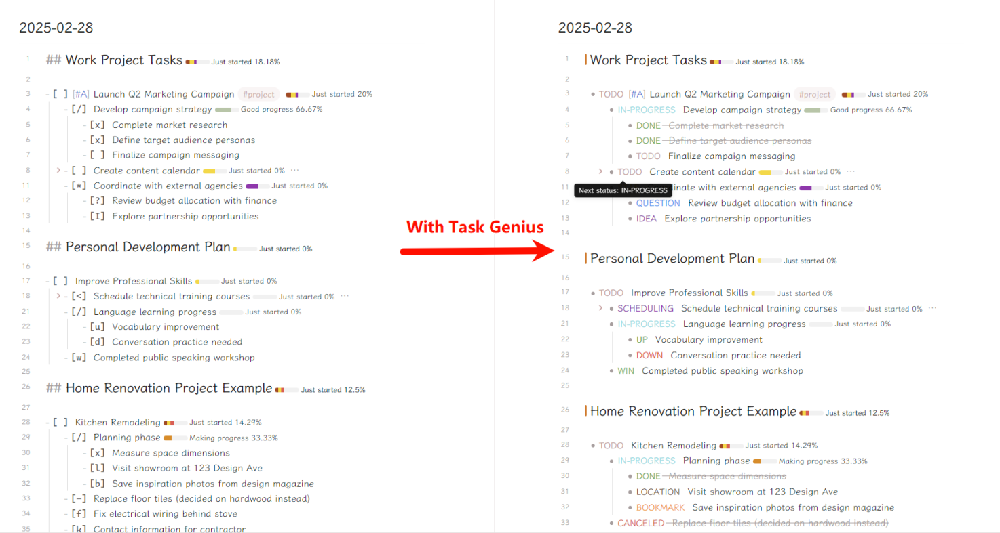

# Task Genius (formerly Obsidian Task Progress Bar)

> **Name Change Notice:** This plugin has been renamed from "Task Progress Bar" to "Task Genius" to better reflect its expanded capabilities. Originally focused on task progress bars, it now includes task status cycling, advanced task management features, and comprehensive task tracking functionality.

A plugin for comprehensive task management in Obsidian, including task progress bars, task status cycling, and advanced task tracking features.

## Key Features

- **Task Progress Bars**: Visualize task completion with customizable progress bars
- **Task Status Cycling**: Easily cycle through task statuses (e.g., TODO → DOING → IN-PROGRESS → DONE)
- **Multiple Task Statuses**: Support for various task states including planned, in-progress, completed, and abandoned tasks
- **Customizable Task Markers**: Define your own task markers and their visual representation
- **Heading Progress Tracking**: Add progress bars to headings to track progress of all tasks under them
- **Conditional Display**: Hide progress bars based on tags, folders, or metadata
- **Progress Statistics**: View task completion counts and percentages



# Usage

For example, when you create a task list like this:

```markdown
- [ ] task1 [ ] [0/1] // Here is the progress bar
	- [ ] task2 // Indent by press tab
```

When you finished the task2,

```markdown
- [ ] task1 [|] [1/1] // The progress bar will be updated
	- [x] task2 // Indent by press tab
```

## Settings

### Basic Settings

1. **Add progress bar to Heading**: Make the Heading showing the task progress bars.
2. **Enable heading progress bars**: Add progress bars to headings to show progress of all tasks under that heading.
3. **Add number to progress bar**: You can see the total/completed number of tasks.
4. **Show percentage**: Display the completion percentage in the progress bar.
5. **Count sub children level of current Task**: Allow the plugin to count sub-tasks in the progress calculation.

### Task Status Settings

You can customize which characters represent different task statuses, or choose from predefined collections.

1. **Completed task markers**: Characters that represent completed tasks (default: `x|X`).
2. **Planned task markers**: Characters that represent planned tasks (default: `?`).
3. **In progress task markers**: Characters that represent tasks in progress (default: `>|/`).
4. **Abandoned task markers**: Characters that represent abandoned tasks (default: `-`).
5. **Not started task markers**: Characters that represent not started tasks (default: space ` `).
6. **Count other statuses as**: Choose which category to count other statuses as.

### Task Counting Settings

1. **Exclude specific task markers**: Specify task markers to exclude from counting (e.g., `?|/`).
2. **Only count specific task markers**: Toggle to only count specific task markers.
3. **Specific task markers to count**: If the above option is enabled, specify which task markers to count.

### Conditional Progress Bar Display

1. **Hide progress bars based on conditions**: Enable hiding progress bars based on tags, folders, or metadata.
2. **Hide by tags**: Specify tags that will hide progress bars (comma-separated, without #).
3. **Hide by folders**: Specify folder paths that will hide progress bars.
4. **Hide by metadata**: Specify frontmatter metadata that will hide progress bars.


## Workflow Feature

Task Genius includes a powerful workflow feature that allows you to track tasks through different stages of completion. This feature helps with project management and tracking task progression.

### How to Use Workflows

1. **Enable Workflows**: First enable the workflow feature in settings.

2. **Basic Workflow Syntax**:
   ```markdown
   - [ ] My task #workflow/project_workflow/planning
   ```

   This creates a task in the "Planning" stage of the "Project Workflow".

3. **Workflow Progression**:
   - When you complete a task by checking it, the workflow automatically advances to the next stage
   - The workflow tag updates (e.g., from `#workflow/project_workflow/planning` to `#workflow/project_workflow/in_progress/development`)
   - A timestamp of the completion is added when configured

4. **Cycle Stages with Sub-stages**:
   ```markdown
   - [ ] My task #workflow/project_workflow/in_progress/development
   ```

   This task is in the "Development" sub-stage of the "In Progress" stage.

### Default Workflow Structure

The default "Project Workflow" includes these stages:

1. **Planning** (linear stage)
   - Next stage: In Progress

2. **In Progress** (cycle stage with sub-stages)
   - Sub-stages: Development, Testing
   - Can proceed to: Review, Cancelled

3. **Review** (cycle stage)
   - Can proceed to: In Progress, Completed

4. **Completed** (terminal stage)

5. **Cancelled** (terminal stage)

### Workflow Context Menu

Right-click on any task to:
- Add a workflow to a task
- Change the current workflow stage
- Add child tasks with the same workflow stage

### Workflow Settings

- **Enable Workflow**: Turn the workflow feature on/off
- **Auto Add Timestamp**: Automatically add a timestamp when a task moves to a new stage (enabled by default)
- **Auto Add Next Task**: Automatically create a new task for the next stage (disabled by default)

## How to Install

### From Plugin Market in Obsidian

💜: Directly install from Obsidian Market.

### Download Manually

🚚: Download the latest release. Extract and put the three files (main.js, manifest.json, styles.css) to
folder `{{obsidian_vault}}/.obsidian/plugins/Obsidian-Task-Progress-Bar`.

## Say Thank You

If you are enjoy using Obsidian-Task-Progress-Bar then please support my work and enthusiasm by buying me a coffee
on [https://www.buymeacoffee.com/boninall](https://www.buymeacoffee.com/boninall).

<a href="https://www.buymeacoffee.com/boninall"></a>
