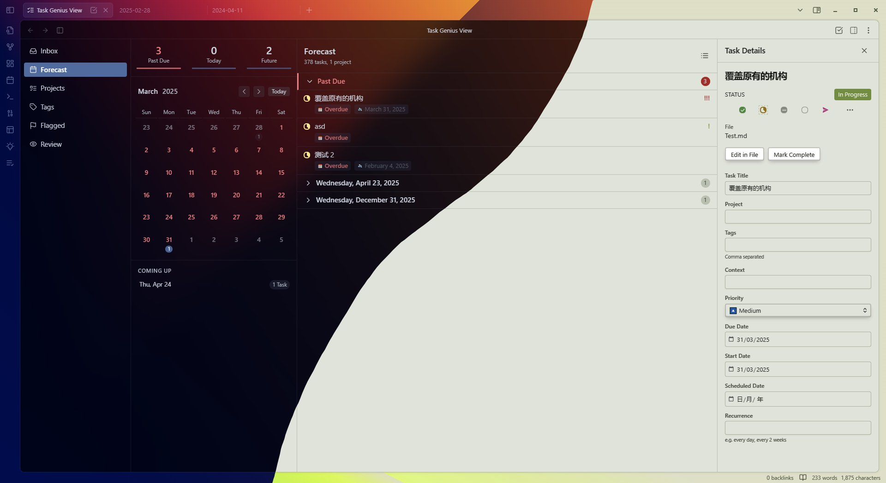

    

Full documentation is available at [Docs](https://taskgenius.md/docs).

---

Task Genius is a comprehensive plugin for Obsidian designed to enhance your task and project management workflow. It integrates seamlessly into your notes, offering visual progress tracking, flexible status management, powerful filtering, and a dedicated view to manage tasks across your vault.

## Key Features

-   **Task Progress Bars**: Visualize parent task completion with customizable graphical or text-based progress bars based on sub-task status. Supports headings and non-task list items.
-   **Advanced Task Statuses & Cycling**: Define custom task statuses beyond `- [ ]` and `- [x]` (e.g., In Progress `[/]`, Planned `[?]`, Abandoned `[-]`). Easily cycle through statuses with clicks or commands.
-   **Date & Priority Management**: Quickly add and modify due dates via a calendar picker (`📅 2023-12-25`) and assign priorities (🔺 Highest, ⏫ High, ..., [#A], [#B], [#C]) through context menus, commands, or clickable icons.
-   **In-Editor Task Filtering**: Dynamically filter tasks within a note based on status, content, tags, and relationships (parent/child/sibling) using a toggleable panel. Save and reuse common filters as presets.
-   **Task Mover**: Archive completed or specific sets of sub-tasks to a designated file using commands, keeping your active notes clean.
-   **Quick Capture**: Rapidly capture tasks or notes to a specified file via an inline panel (`Alt+C`), a global command, or a full-featured modal for adding metadata.
-   **Workflow Management**: Define multi-stage workflows (e.g., Todo -> Doing -> Review -> Done) and track tasks through them. Includes options for automatic timestamping, duration tracking, and next-task creation.
-   **Dedicated Task View**: A powerful, unified interface (`Task Genius: Open Task Genius view`) to see, sort, filter, and manage all tasks across your vault. Includes modes like Inbox, Forecast, Tags, Projects, and Review.
-   **Customizable Settings**: Extensive options to configure the appearance and behavior of all features.

## Installation

### From Obsidian Community Plugins

1.  Open `Settings` -> `Community plugins`.
2.  Make sure "Restricted mode" is **off**.
3.  Click `Browse` community plugins.
4.  Search for "Task Genius".
5.  Click `Install`.
6.  Once installed, `Enable` the plugin.

### Manual Installation

1.  Download the latest release (`main.js`, `manifest.json`, `styles.css`) from the [Releases page](https://github.com/Quorafind/Obsidian-Task-Genius/releases).
2.  Navigate to your Obsidian vault's plugins folder: `YourVault/.obsidian/plugins/`.
3.  Create a new folder named `task-genius`.
4.  Copy the downloaded `main.js`, `manifest.json`, and `styles.css` files into the `task-genius` folder.
5.  Reload Obsidian (or disable and re-enable the plugin).
6.  Enable the plugin in `Settings` -> `Community plugins`.

## Support Me

If you enjoy Task Genius and find it useful, please consider supporting my work by buying me a coffee! It helps me dedicate time to maintaining and improving the plugin.

