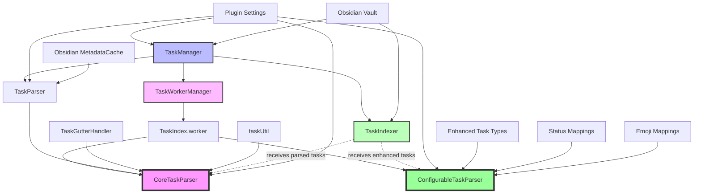

# Task Parsing Architecture

This document describes the refactored task parsing architecture and the dependencies between components.

## Overview

The task parsing system has been refactored to eliminate code duplication and create a clear separation of concerns. The new architecture uses a unified core parser that all other components depend on.

## Core Components

### 1. CoreTaskParser (`src/utils/parsing/CoreTaskParser.ts`)

**Purpose:** The single source of truth for standard task parsing operations.

**Responsibilities:**
- Parse individual task lines
- Parse entire file content
- Extract metadata (dates, priority, tags, projects, context)
- Build task hierarchy based on indentation
- Handle heading context

**Features:**
- Configurable metadata format (tasks/dataview)
- Support for heading filtering (ignore/focus)
- Hierarchical task parsing
- Comprehensive metadata extraction

```typescript
// Usage example
const parser = new CoreTaskParser({
    preferMetadataFormat: "tasks",
    parseHeadings: true,
    parseHierarchy: true
});

const task = parser.parseTaskLine(filePath, line, lineNumber);
const tasks = parser.parseFileContent(filePath, content);
```

### 2. ConfigurableTaskParser (`src/utils/workers/ConfigurableTaskParser.ts`)

**Purpose:** Advanced task parsing with enhanced configuration and features.

**Responsibilities:**
- Parse tasks with custom status mappings
- Handle multiline comments
- Support enhanced task metadata
- Provide flexible emoji and tag parsing
- Generate both standard and enhanced task formats

**Features:**
- Custom status character mapping (e.g., "/" -> "InProgress")
- Multiline comment parsing
- Enhanced task format with additional fields
- Configurable emoji mapping for metadata
- Special tag prefix handling (e.g., #project/name -> project: "name")
- Performance controls (max iterations, stack size limits)

```typescript
// Usage example
const parser = new MarkdownTaskParser({
    parseMetadata: true,
    parseTags: true,
    parseComments: true,
    parseHeadings: true,
    statusMapping: { "/": "InProgress", "-": "Cancelled" },
    emojiMapping: { "📅": "due", "🔺": "priority" },
    specialTagPrefixes: { "project": "project", "area": "area" }
});

// Get enhanced tasks
const enhancedTasks = parser.parse(content, filePath);

// Get legacy format for compatibility
const standardTasks = parser.parseLegacy(content, filePath);
```

### 3. TaskParser (`src/utils/import/TaskParser.ts`)

**Purpose:** File-level task parsing with Obsidian metadata integration.

**Responsibilities:**
- Integrate with Obsidian's metadata cache
- Provide backward compatibility
- Handle ListItemCache optimization

**Dependencies:**
- CoreTaskParser (for actual parsing)
- Obsidian's MetadataCache

```typescript
// Usage example
const parser = new TaskParser({
    preferMetadataFormat: "tasks",
    useMetadataCache: true
});

const tasks = await parser.parseTasksFromFile(file, content, metadata);
```

### 4. TaskIndexer (`src/utils/import/TaskIndexer.ts`)

**Purpose:** High-performance task indexing and querying.

**Responsibilities:**
- Index tasks by various criteria (tags, projects, dates, etc.)
- Provide fast querying capabilities
- Maintain task cache
- Handle cache updates

**Dependencies:**
- Receives parsed tasks from external components
- No direct parsing dependencies

```typescript
// Usage example
const indexer = new TaskIndexer(app, vault, metadataCache);
indexer.updateIndexWithTasks(filePath, tasks);
const results = indexer.queryTasks(filters, sorting);
```

### 5. TaskWorkerManager (`src/utils/workers/TaskWorkerManager.ts`)

**Purpose:** Manage background task processing using web workers.

**Responsibilities:**
- Coordinate worker threads
- Handle batch processing
- Manage worker lifecycle
- Provide concurrency control

**Dependencies:**
- TaskIndex.worker.ts (the actual worker)

### 6. TaskIndex.worker.ts (`src/utils/workers/TaskIndex.worker.ts`)

**Purpose:** Background task parsing in web worker.

**Responsibilities:**
- Parse tasks in background thread
- Handle batch operations
- Communicate with main thread

**Dependencies:**
- CoreTaskParser (for unified parsing logic)
- ConfigurableTaskParser (fallback for enhanced parsing)

### 7. TaskManager (`src/utils/TaskManager.ts`)

**Purpose:** Primary interface for all task management operations.

**Responsibilities:**
- Coordinate all task-related operations
- Manage initialization and caching
- Handle task updates and recurring tasks
- Provide unified API

**Dependencies:**
- TaskIndexer (for indexing and querying)
- TaskWorkerManager (for background processing)
- CoreTaskParser (indirectly through workers)

### 8. Supporting Components

#### TaskGutterHandler (`src/editor-ext/TaskGutterHandler.ts`)
- Uses CoreTaskParser for line-level parsing
- Provides task markers in editor gutter

#### taskUtil.ts (`src/utils/taskUtil.ts`)
- Provides backward compatibility
- Delegates to CoreTaskParser
- Contains legacy utility functions

## Architecture Diagram



## Key Benefits of the Refactored Architecture

### 1. **Unified Parsing Logic**
- Single source of truth eliminates code duplication
- Consistent parsing behavior across all components
- Easier maintenance and bug fixes

### 2. **Clear Separation of Concerns**
- **CoreTaskParser**: Pure parsing logic
- **TaskParser**: Obsidian integration
- **TaskIndexer**: Indexing and querying
- **TaskManager**: Coordination and API

### 3. **Performance Improvements**
- Worker-based parsing for large files
- Efficient caching and indexing
- Minimal redundant operations

### 4. **Maintainability**
- Modular design
- Clear dependencies
- Easier testing
- Reduced complexity

### 5. **Extensibility**
- Easy to add new parsing features
- Simple to extend indexing capabilities
- Straightforward worker optimizations

## Migration Guide

### For Existing Code Using TaskParser

```typescript
// Old way
const parser = new TaskParser();
const task = parser.parseTask(line, filePath, lineNum);

// New way - use CoreTaskParser directly for better performance
const parser = new CoreTaskParser({ preferMetadataFormat: "tasks" });
const task = parser.parseTaskLine(filePath, line, lineNum);

// Or continue using TaskParser for file-level parsing with metadata cache
const fileParser = new TaskParser({ useMetadataCache: true });
const tasks = await fileParser.parseTasksFromFile(file, content, metadata);
```

### For Existing Code Using parseTaskLine from taskUtil

```typescript
// Old way
import { parseTaskLine } from "../utils/taskUtil";
const task = parseTaskLine(filePath, line, lineNum, format);

// New way - function still works but is deprecated
// Recommended: Use CoreTaskParser directly
import { CoreTaskParser } from "../utils/parsing/CoreTaskParser";
const parser = new CoreTaskParser({ preferMetadataFormat: format });
const task = parser.parseTaskLine(filePath, line, lineNum);
```

## Configuration

All parsing components accept configuration options:

```typescript
interface CoreParsingOptions {
    preferMetadataFormat: "tasks" | "dataview";
    parseHeadings: boolean;
    ignoreHeading?: string;
    focusHeading?: string;
    parseHierarchy: boolean;
}
```

## Error Handling

The architecture provides robust error handling:

1. **Graceful Degradation**: If the core parser fails, workers fall back to legacy parsing
2. **Isolation**: Worker errors don't affect the main thread
3. **Retry Logic**: Failed tasks are retried with exponential backoff
4. **Logging**: Comprehensive error logging for debugging

## Performance Considerations

1. **Caching**: Parsers are cached and reused when possible
2. **Worker Pool**: Multiple workers for parallel processing
3. **Batch Processing**: Efficient batch operations for large datasets
4. **Lazy Loading**: Components are initialized only when needed

## Testing

Each component can be tested independently:

```typescript
// Test CoreTaskParser
const parser = new CoreTaskParser(testConfig);
const result = parser.parseTaskLine(testFile, testLine, 1);
expect(result).toMatchObject(expectedTask);

// Test TaskIndexer
const indexer = new TaskIndexer(mockApp, mockVault, mockCache);
indexer.updateIndexWithTasks(filePath, testTasks);
const results = indexer.queryTasks([{ type: "tag", operator: "contains", value: "test" }]);
expect(results).toHaveLength(expectedCount);
```

This architecture provides a solid foundation for future enhancements while maintaining backward compatibility and improving performance. 
